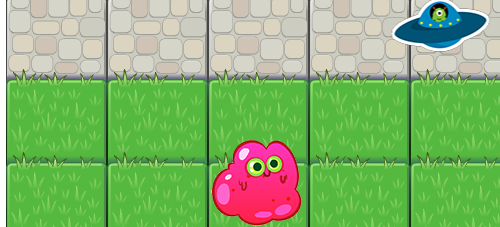
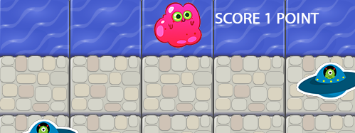

# Classic Arcade Clone
***Udacity Nano Degree***

## Aim of the game

The aim of the game is to get to the opposite side of the road without getting hit by the UFO's.

## How to play

**Download:-** You can download this project and run it from your own desktop, to do this look for the green button "Clone or Download" then from the dropdown select download zip, once fully downloaded unzip with the choice of archive tool into a directory of your choosing, this all you need to do is clink the index.html file. 

**YOU MAY NEED TO CLICK IN THE GAME WINDOW TO FOCUS THE KEBOARD**

**Play direct on GitHub by following this link  --->** <https://rawgit.com/chriscom78/classic-clone/master/>

**Moving:-** move your character around the map by using the arrow keys on your keyboard, you are able to move in all directions => UP, DOWN, LEFT & RIGHT.

**Score Points:-** Score Points:- Get your character across safely to score one point.

## Contribute to this project

* Fork the project & clone locally.
* Create an upstream remote and sync your local copy before you branch.
* Branch for each separate piece of work.
* Do the work, write good commit messages, and read the CONTRIBUTING file if there is one.
* Push to your origin repository.
* Create a new PR in GitHub.
* Respond to any code review feedback.

## More to do - Help welcome :)
* Add a Life system to stop things being repetitive
* Record and save the highest score.
* Add a leader board with player name input.
* Add sound for re-spawn, killed and success.
* Have items to collect and create a bonus system.
* Make the map bigger
* Create levels.

## Thanks

Thanks to my mentor for helping through a few hard times before getting to this project.

I researched a lot online as well as books found on amazon and have implemented some code found on stack overflow, I have commented in the code to reflect this.

